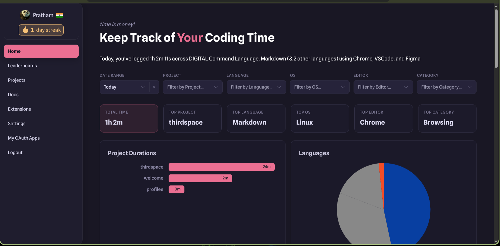
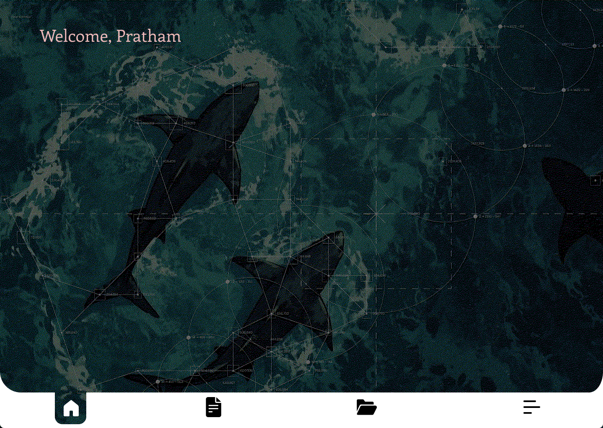

# The project for third-space

Me and my team are creating a really cool photo editor with these options to edit the photos with :
- Geometric composition 
- Dithering 
- ASCII Overlay 
- Image Tracking 

## What's my work?

I've taken the responsibility of designing the UI UX for the app in figma.

## My obstacle..

Today, I've started crafting the layput nad designing in figma. 

I've found out that there's a wakatime extension for figma which allows me to track my time in figma. 

I tried it. I did designing for ~2 hours. But it only counted as 10 mins. 

I switched to official Wakatime extension. Used the hackatime's API keys.

But it showed only the time that I spend on creating that. But, didn't specified that I was doing in figma. It calculated as a digital command language. 

### What's the proof?

Here'e the link of the figma file. : [Click here](https://www.figma.com/design/64lfBliFiOIXm2WtlkBUxW/thirdspace?node-id=2-2&t=sg0Ki61vjhwBJeBD-1)

### Here's the image that 

### The screenshot :
